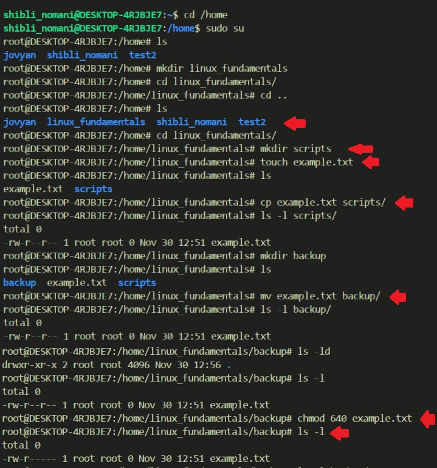
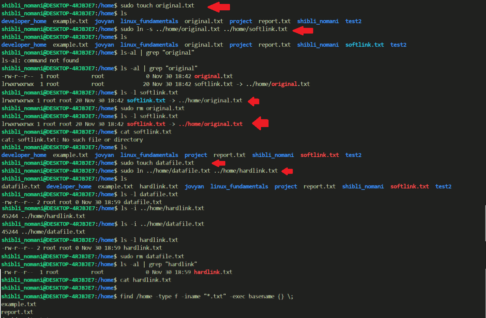

# 💻 Mastering Linux Fundamentals:

## 🔍 File System Navigation
- List the contents of the home directory.

- Change the current directory to /var/log and list its contents.

- Find and display the path to the bash executable using the which command.

- Find current shell

## 📁 File and Directory Operations
- Create a directory named linux_fundamentals in your home directory.
- Inside linux_fundamentals, create a subdirectory named scripts.
- Create an empty file named example.txt inside the linux_fundamentals directory.
- Copy example.txt to the scripts directory.
- Move example.txt from linux_fundamentals to linux_fundamentals/backup.
Permissions
- Change the permissions of example.txt to read and write for the owner, and read-only for the group and others.
- Verify the permission changes using ls -l

**Permission Types:**

- Read (r) – View the contents of the file.
- Write (w) – Modify or delete the file.
- Execute (x) – Run the file as a program/script.

**Permission Categories:**

- User (u) – The owner of the file.
- Group (g) – A group of users.
- Others (o) – Everyone else.

**Permission Values with Icons:**

- r (Read) 📖 = 4
  - Allows viewing or listing file contents.
- w (Write) ✍️ = 2
  - Allows modifying or deleting files.
- x (Execute) 🚀 = 1
  - Allows running the file as a program or accessing a directory.

**Combining Permissions:**
- rwx (📖✍️🚀) = 7 – Full access
- rw- (📖✍️) = 6 – Read and write
- r-x (📖🚀) = 5 – Read and execute
- r-- (📖) = 4 – Read-only

## ✏️ File Modification

- Create a file named example.txt in your home directory.
- Change the owner of example.txt to a user named student
- Change the group of example.txt to a group named students.
- Verify the changes using appropriate commands.

## 👥 Ownership
- Create a directory named project in your home directory.
- Create a file named report.txt inside the project directory.
- Set the permissions of report.txt to read and write for the owner, and read-only for the group and others.
- Set the permissions of the project directory to read, write, and execute for the owner, and read and execute for the group and others
- Verify the changes using appropriate commands.

## ➕ User Add/Modify
- Create a new user named developer.
- Set the home directory of the user developer to /home/developer_home.
- Assign the shell /bin/sh to the user developer.
- Verify the new user's information.
- Change the username of the user developer to devuser.
- Add devuser to a group named devgroup.
- Set the password of devuser to devpass. ( hint: use passwd command. Run passwd --help to see available options)
- Verify the changes made to the user.

## 🔗 Hard/Soft Link
- Create a file named original.txt in your home directory.  
- Create a symbolic link named softlink.txt pointing to original.txt.  
- Verify the symbolic link and ensure it points to the correct file.  
- Delete the original file original.txt and observe the status of the symbolic link.  
- Create a file named datafile.txt in your home directory.  
- Create a hard link named hardlink.txt pointing to datafile.txt.  
- Verify the hard link and ensure it correctly points to the file.  
- Check the inode of both datafile.txt and hardlink.txt.  
- Delete the original file datafile.txt and observe the status of the hard link.  
- Find all .txt files in your home directory. (use find command. Run find --help for usage)  

## 📦 Package Installation
- Update repo cache using apt/apt-get
- Install a package named tree
- Install gcloud CLI tool using apt ( Follow instructions from here: https://cloud.google.com/sdk/docs/install#deb )

